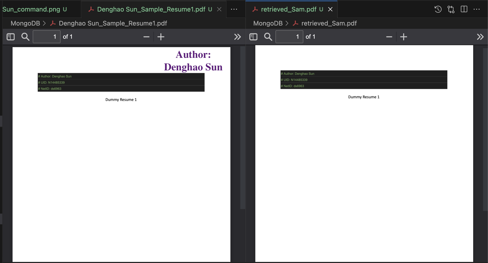

# DB---Denghao-Sun---homework-1

## MongoDB Data Migration Sample

A sample program demonstrating how to migrate data from CSV files and associated PDFs into MongoDB. Developed by Denghao Sun.

## Features

- **CSV to MongoDB Migration**:
  - Script: `MongoDB_Migration_CSV.py`
  - Description: Reads data from CSV files and inserts it into a MongoDB instance. It also stores associated PDF files using GridFS.
  
- **Retrieve PDFs from MongoDB**:
  - Script: `getfile.py`
  - Description: Fetches and saves PDFs from MongoDB back to the filesystem.

## Screenshots

### Running the Commands

### Comparing Result with Original Data

